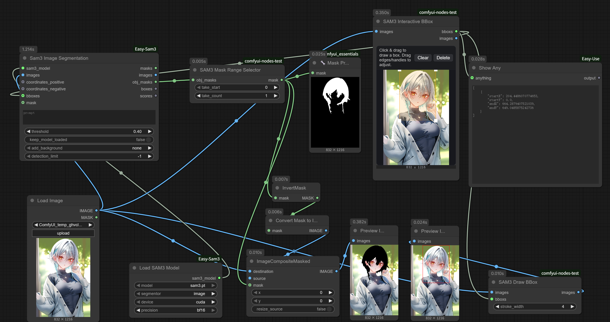

# comfyui-easy-sam3-tools

Custom nodes for building SAM3-centric editing pipelines inside ComfyUI. They pair well with **comfyui-easy-sam3** and **comfyui-kjnodes**, letting you harness SAM3’s zero-shot segmentation accuracy for precise masks that can drive local inpainting, editing, or any downstream compositing task.

## Nodes

| Node | Description |
| ---- | ----------- |
| `Sam3MaskRangeSelector` | Consumes ordered SAM3 `obj_masks`, extracts a configurable slice (`take_start`, `take_count`), and merges the selection into a single mask per frame for focused edits. |
| `Sam3DrawBBox` | Renders SAM3 / VLM bounding boxes over image tensors. Accepts JSON strings, `{boxes: [...]}` payloads, tensors, or per-batch lists, normalizes them, then emits an overlayed tensor. |
| `Sam3InteractiveBBoxEditor` | DOM-based bbox editor widget. Streams the upstream image, lets you author/adjust boxes interactively, and outputs KJ-format bounds alongside the passthrough image for subsequent SAM3 inference. |

## Installation

Drop the folder inside `ComfyUI/custom_nodes/`, then restart ComfyUI.
